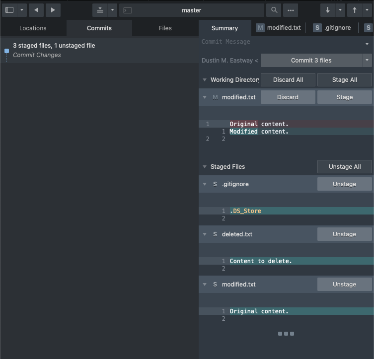
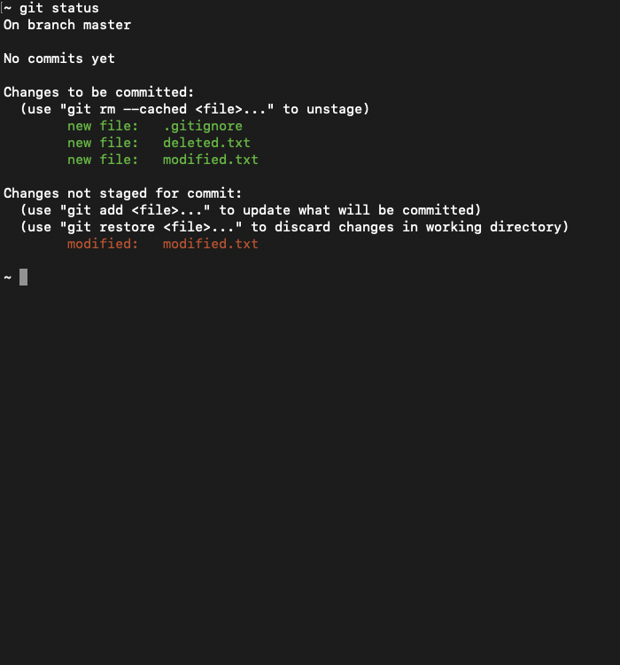
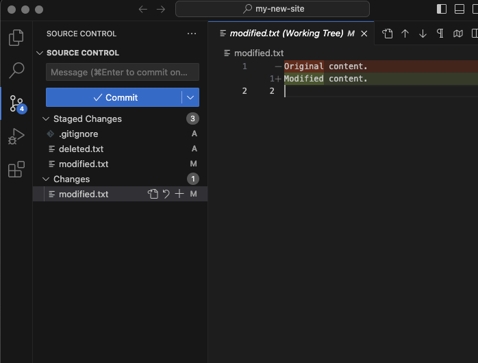
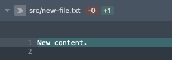
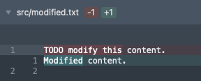
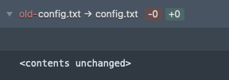
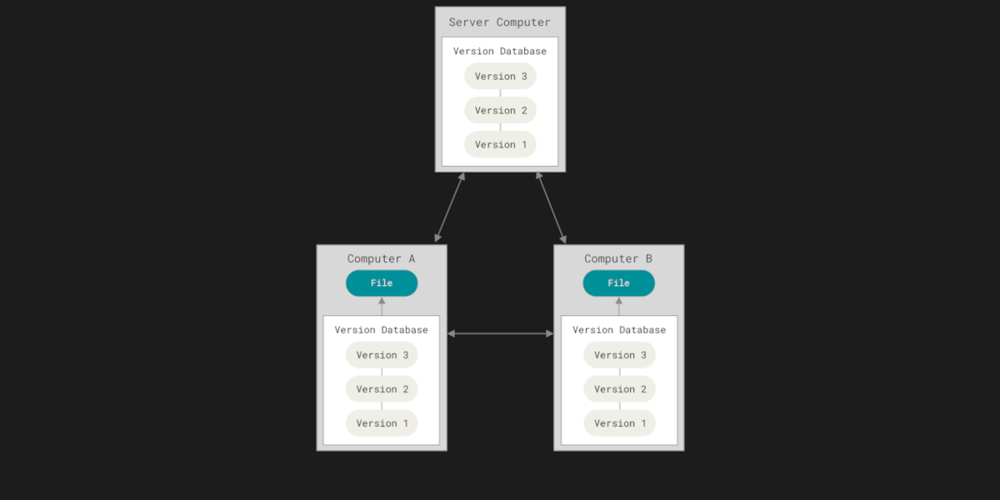

# Git On My Level: Bridging Knowledge with Practical Solutions

## Description

If you write code, you're likely using Git. If not, you probably should be—unless you enjoy the thrill of losing track of your work and spending hours hunting down bugs. But don’t worry, this talk isn't about convincing you why Git is a must; there are plenty of resources for that. Instead, we’ll address why many developers feel uneasy about performing complex operations with Git. Although there are numerous resources available to learn Git, I believe a major reason for the unease is the traditional method of teaching—introducing one command or term at a time, often without practical examples of how to use them.

In this session, we’ll bridge that gap. We’ll tackle common Git challenges, dive into practical solutions, and dissect the mechanics behind each approach. You'll learn the pros and cons of different strategies and gain actionable insights to resolve frequent issues faced by you and your team during collaboration.

By the end of this session, you'll be equipped with the skills and confidence to handle Git more effectively and improve your development workflow.

Most of this presentation's information was found in sections 1-3 of the [Pro Git book](https://git-scm.com/book/en/v2), its problems come from my career, and its solutions come from past tears I have shed.

## Term: Client

The tool you use to interact with Git.

<details>
<summary>Sublime Merge</summary>



</details>

<details>
<summary>Git CLI</summary>



</details>

<details>
<summary>VS Code</summary>



</details>

## Note: Command Syntax

- Commands use `<>` to wrap sections of code that you should replace and `[]` to denote optional segments.
- Shorthand aliases (one "-" instead of "--") require a space instead of an equal sign when they accept values.
```bash
git log –max-count=<number>
git log -n <number>
git log -<number>
```
- Order of arguments is sometimes important. In such cases they are listed in the order they must go in.
```bash
git diff --staged [<path to file(s)>]
```

## Term: Repository

Directory storing all Git information.


## How Do I Create A New Repository?

<details>
<summary>Follow Along</summary>

```bash
mkdir my-new-site
cd my-new-site
git init
```

</details>

```
~ mkdir my-new-site
my-new-site
~ cd my-new-site
~ git init
Initialized empty Git repository in /Users/deastway/Sites/my-new-site/.git/
```

## How Do I Clone An Existing Repository?

Using SSH.

```
~ git clone git@github.com:DustinMEastway/git-on-my-level.git
Cloning into 'git-on-my-level'...
remote: Enumerating objects: 184, done.
remote: Counting objects: 100% (126/126), done.
remote: Compressing objects: 100% (91/91), done.
remote: Total 184 (delta 67), reused 90 (delta 35), pack-reused 58 (from 1)
Receiving objects: 100% (184/184), 1.72 MiB | 7.93 MiB/s, done.
Resolving deltas: 100% (90/90), done.
```

## How Do I Clone An Existing Repository?

Using HTTPS.

```
~ git clone https://github.com/DustinMEastway/git-on-my-level.git
Cloning into 'git-on-my-level'...
remote: Enumerating objects: 184, done.
remote: Counting objects: 100% (126/126), done.
remote: Compressing objects: 100% (91/91), done.
remote: Total 184 (delta 67), reused 90 (delta 35), pack-reused 58 (from 1)
Receiving objects: 100% (184/184), 1.72 MiB | 10.06 MiB/s, done.
Resolving deltas: 100% (90/90), done.
```

## How Do I Get The Repository’s Status?

<details>
<summary>Follow Along</summary>

```bash
git status
```

</details>

```
~ git status
On branch master

No commits yet

nothing to commit (create/copy files and use "git add" to track)
```

Or.

```
~ git status
On branch main
Your branch is up to date with 'origin/main'.

nothing to commit, working tree clean
```

## Note: Four States Of Files


> [!NOTE]
> Source: Chapter 2.2 (figure 8) of the Pro Git book V2

## How Do I Get The Repository’s Status?

<details>
<summary>Follow Along</summary>

```bash
mkdir src
echo "TODO delete this file." > src/accidental-file.txt
echo "TODO modify this content." > src/modify.md
echo "Content to rename." > old-config.txt
git status
```

</details>

```
~ mkdir src
src
~ echo "TODO delete this file." > src/accidental-file.txt
~ echo "TODO modify this content." > src/modify.md
~ echo "Content to rename." > old-config.txt
~ git status
On branch master

No commits yet

Untracked files:
  (use "git add <file>..." to include in what will be committed)
  old-config.txt
  src/

nothing added to commit but untracked files present (use "git add" to track)
```

## How Do I Add Files To A Repository?

File path(s).

<details>
<summary>Follow Along</summary>

```bash
git add old-config.txt src/accidental-file.txt
git status
```

</details>

```
~ git add old-config.txt src/accidental-file.txt
~ git status
On branch master

No commits yet

Changes to be committed:
  (use "git rm --cached <file>..." to unstage)
  new file:   old-config.txt
  new file:   src/accidental-file.txt

Untracked files:
  (use "git add <file>..." to include in what will be committed)
  src/modify.md
```

## Note: File(s) Command Arguments

Pathspec - directory/file path, pattern, etc.

Accept one or more of the following separated by spaces.
- Directory path.
  - Example: `src/` matches all files in the "src" subdirectory.
- File path.
  - Example: `src/accidental-file.txt` matches "accidental-file.txt" in "src".
- Pattern.
  - Example: `*.txt` matches all ".txt" files.
  - Example: `src/*.txt` matches all ".txt" files in the "src" directory.

## How Do I Add Files To A Repository?

Directory path(s).

<details>
<summary>Follow Along</summary>

```bash
git add src
git status
```

</details>

```
~ git add src
~ git status
On branch master

No commits yet

Changes to be committed:
  (use "git rm --cached <file>..." to unstage)
  new file:   old-config.txt
  new file:   src/accidental-file.txt
  new file:   src/modify.md
```

## How Do I Ignore Files?

Untracked files in `.gitignore`.

```
~ git status
On branch master

No commits yet

Changes to be committed:
  (use "git rm --cached <file>..." to unstage)
  new file:   old-config.txt
  new file:   src/accidental-file.txt
  new file:   src/modify.md

Untracked files:
  (use "git add <file>..." to include in what will be committed)
  .DS_Store
  src/.DS_Store
```

## How Do I Ignore Files?

Untracked files in `.gitignore`.

<details>
<summary>Follow Along</summary>

```bash
echo ".DS_Store" > .gitignore
git status
git add .gitignore
```

</details>

```
~ echo ".DS_Store" > .gitignore
~ git status
On branch master

No commits yet

Changes to be committed:
  (use "git rm --cached <file>..." to unstage)
  new file:   old-config.txt
  new file:   src/accidental-file.txt
  new file:   src/modify.md

Untracked files:
  (use "git add <file>..." to include in what will be committed)
  .gitignore

~ git add .gitignore
```

## Note: Commonly Ignored Files

- Dependencies (e.g. “node_modules”).
- Compiled output (e.g. “dist”, “build”, etc.).
- Files with secrets (e.g. “.env”).
- Personal IDE configurations (e.g. “.vscode”).

## How Do I Display Changes?

Staged changes.

<details>
<summary>Follow Along</summary>

```bash
git diff --staged
```

</details>

```
~ git diff --staged
diff --git a/.gitignore b/.gitignore
new file mode 100644
index 0000000..e43b0f9
--- /dev/null
+++ b/.gitignore
@@ -0,0 +1 @@
+.DS_Store
diff --git a/old-config.txt b/old-config.txt
new file mode 100644
index 0000000..213fa47
--- /dev/null
+++ b/old-config.txt
@@ -0,0 +1 @@
+Content to rename.
diff --git a/src/accidental-file.txt b/src/accidental-file.txt
new file mode 100644
index 0000000..75cf8c6
--- /dev/null
+++ b/src/accidental-file.txt
@@ -0,0 +1 @@
+TODO delete this file.
diff --git a/src/modify.md b/src/modify.md
new file mode 100644
index 0000000..d026723
--- /dev/null
+++ b/src/modify.md
@@ -0,0 +1 @@
+TODO modify this content.
```

## How Do I Display Changes?

A file's staged changes.

<details>
<summary>Follow Along</summary>

```bash
git diff --staged src/modify.md
```

</details>

```
~ git diff --staged src/modify.md
diff --git a/src/modify.md b/src/modify.md
new file mode 100644
index 0000000..d026723
--- /dev/null
+++ b/src/modify.md
@@ -0,0 +1 @@
+TODO modify this content.
```

## Note: Modifying A Staged File

<details>
<summary>Follow Along</summary>

```bash
echo "Modified content." > src/modify.md
git status
```

</details>

```
~ echo "Modified content." > src/modify.md
~ git status
On branch master

No commits yet

Changes to be committed:
  (use "git rm --cached <file>..." to unstage)
  new file:   .gitignore
  new file:   old-config.txt
  new file:   src/accidental-file.txt
  new file:   src/modify.md

Changes not staged for commit:
  (use "git add <file>..." to update what will be committed)
  (use "git restore <file>..." to discard changes in working directory)
  modified:   src/modify.md
```

## How Do I Display Changes?

Unstaged changes.

<details>
<summary>Follow Along</summary>

```bash
git diff src/modify.md
```

</details>

```
~ git diff src/modify.md
diff --git a/src/modify.md b/src/modify.md
index d026723..acd49db 100644
--- a/src/modify.md
+++ b/src/modify.md
@@ -1 +1 @@
-TODO modify this content.
+Modified content.
```

## Term: Change

<details>
<summary>Add a file.</summary>



</details>

<details>
<summary>Delete a file.</summary>


</details>

<details>
<summary>Edit lines.</summary>



</details>

<details>
<summary>Move/rename a file.</summary>



</details>

## Note: Four States Of Changes

- **Untracked** - Created an untracked file.
- **Unstaged** - Change made to an unmodified or staged file that has not been staged yet.
- **Staged** - Change will go into next commit.
- **Committed** - Change already added to a commit to “save” it.

## Term: Commit


## How Do I Save Changes?

<details>
<summary>Follow Along</summary>

```bash
git commit -m "initial commit"
git status
```

</details>

```
~ git commit -m "initial commit"
[master (root-commit) 2d4fc5b] initial commit
 4 files changed, 4 insertions(+)
 create mode 100644 .gitignore
 create mode 100644 old-config.txt
 create mode 100644 src/accidental-file.txt
 create mode 100644 src/modify.md
~ git status
On branch master
Changes not staged for commit:
  (use "git add <file>..." to update what will be committed)
  (use "git restore <file>..." to discard changes in working directory)
  modified:   src/modify.md

no changes added to commit (use "git add" and/or "git commit -a")
```

## Term: Local & Remote



> [!NOTE]
> Source: Chapter 1.1 (figure 3) of the Pro Git book V2

## How Do I Display Remotes?

<details>
<summary>Follow Along</summary>

```bash
git remote
```

</details>

```
~ git remote
```

Or

```
~ git remote
origin
```

## How Do I Add A Remote?

<details>
<summary>Follow Along</summary>

```bash
git remote add origin https://github.com/DustinMEastway/my-new-site.git
git remote
```

</details>

```
~ git remote add origin https://github.com/DustinMEastway/my-new-site.git
~ git remote
origin
```

## How Do I Remove A Remote?

<details>
<summary>Follow Along</summary>

```bash
git remote remove origin
git remote
git remote add origin https://github.com/DustinMEastway/my-new-site.git
```

</details>

```
~ git remote remove origin
~ git remote
~ git remote add origin https://github.com/DustinMEastway/my-new-site.git
```

## How Do I Display The URL For A Remote?

<details>
<summary>Follow Along</summary>

```bash
git remote get-url origin
```

</details>

```
~ git remote get-url origin
https://github.com/DustinMEastway/my-new-site.git
```

## How Do I Set The URL For A Remote?

<details>
<summary>Follow Along</summary>

```bash
git remote set-url origin git@github.com:DustinMEastway/my-new-site.git
git remote get-url origin
```

</details>

```
~ git remote set-url origin git@github.com:DustinMEastway/my-new-site.git
~ git remote get-url origin
git@github.com:DustinMEastway/my-new-site.git
```

## How Do I Upload Changes To Remote?

With an unset upstream branch.

<details>
<summary>Follow Along</summary>

```bash
git push
git push --set-upstream origin master
```

</details>

```
~ git push
fatal: The current branch master has no upstream branch.
To push the current branch and set the remote as upstream, use

    git push --set-upstream origin master

To have this happen automatically for branches without a tracking
upstream, see 'push.autoSetupRemote' in 'git help config'.

~ git push --set-upstream origin master
Enumerating objects: 7, done.
Counting objects: 100% (7/7), done.
Delta compression using up to 12 threads
Compressing objects: 100% (3/3), done.
Writing objects: 100% (7/7), 489 bytes | 489.00 KiB/s, done.
Total 7 (delta 0), reused 0 (delta 0), pack-reused 0
To github.com:DustinMEastway/my-new-site.git
 * [new branch]      master -> master
branch 'master' set up to track 'origin/master'.
```

## How Do I Delete Files?

<details>
<summary>Follow Along</summary>

```bash
echo "Staged" > src/accidental-staged.txt
echo "Untracked" > src/accidental-untracked.txt
git add src/accidental-staged.txt
rm src/accidental-file.txt src/accidental-staged.txt src/accidental-untracked.txt
git add src/accidental-file.txt src/accidental-staged.txt src/modify.md
git status
```

</details>

```
~ echo "Staged" > src/accidental-staged.txt
~ echo "Untracked" > src/accidental-untracked.txt
~ git add src/accidental-staged.txt
~ rm src/accidental-file.txt src/accidental-staged.txt src/accidental-untracked.txt
~ git add src/accidental-file.txt src/accidental-staged.txt src/modify.md
~ git status
On branch master
Your branch is up to date with 'origin/master'.

Changes to be committed:
  (use "git restore --staged <file>..." to unstage)
  deleted:    src/accidental-file.txt
  modified:   src/modify.md
```

## How Do I Move / Rename Files?

<details>
<summary>Follow Along</summary>

```bash
mv old-config.txt config.txt
git add config.txt old-config.txt
git status
```

</details>

```
~ mv old-config.txt config.txt
~ git add config.txt old-config.txt
~ git status
On branch master
Your branch is up to date with 'origin/master'.

Changes to be committed:
  (use "git restore --staged <file>..." to unstage)
  renamed:    old-config.txt -> config.txt
  deleted:    src/accidental-file.txt
  modified:   src/modify.md
```

## Warning: Dangers Of Moving Files

<details>
<summary>Follow Along</summary>

```bash
echo "TODO delete this file." > config.txt
git add config.txt
git status
echo "Content to rename." > config.txt
git add config.txt
```

</details>

```
~ echo "TODO delete this file." > config.txt
~ git add config.txt
~ git status
On branch master
Your branch is up to date with 'origin/master'.

Changes to be committed:
  (use "git restore --staged <file>..." to unstage)
  renamed:    src/accidental-file.txt -> config.txt
  deleted:    old-config.txt
  modified:   src/modify.md

~ echo "Content to rename." > config.txt
~ git add config.txt
```

## Prep Content

<details>
<summary>Follow Along</summary>

```bash
echo "New content." > src/new-file.txt
git add src/new-file.txt
git commit -m "test different change types"
echo "{ \"isDev\": true }" > config.txt
git add config.txt
git commit -m "update config content"
mv config.txt config.json
git add config.json config.txt
git commit -m "update config content"
git status
```

</details>

```
~ echo "New content." > src/new-file.txt
~ git add src/new-file.txt
~ git commit -m "test different change types"
[master 125a205] test different change types
 4 files changed, 2 insertions(+), 2 deletions(-)
 rename old-config.txt => config.txt (100%)
 delete mode 100644 src/accidental-file.txt
 create mode 100644 src/new-file.txt
~ echo "{ \"isDev\": true }" > config.txt
~ git add config.txt
~ git commit -m "update config content"
[master b2c5f49] update config content
 1 file changed, 1 insertion(+), 1 deletion(-)
~ mv config.txt config.json
~ git add config.json config.txt
~ git commit -m "update config content"
[master 0cc84e5] update config content
 1 file changed, 0 insertions(+), 0 deletions(-)
 rename config.txt => config.json (100%)
~ git status
On branch master
Your branch is ahead of 'origin/master' by 3 commits.
  (use "git push" to publish your local commits)

nothing to commit, working tree clean
```

## How Do I Display Commits?

<details>
<summary>Follow Along</summary>

```bash
git log
```

</details>

```
~ git log
commit 0cc84e5b386474398b4756ed6e1b09d45d48cfe2 (HEAD -> master)
Author: Dustin M. Eastway <Dustin.Eastway@gmail.com>
Date:   Fri Dec 27 16:28:04 2024 -0500

    update config content

commit b2c5f4990fb84a7fddd62441ade8e9e41e9e890f
Author: Dustin M. Eastway <Dustin.Eastway@gmail.com>
Date:   Fri Dec 27 16:27:52 2024 -0500

    update config content

commit 125a2054d22c0f19b8407bbf647549252ad03428
Author: Dustin M. Eastway <Dustin.Eastway@gmail.com>
Date:   Fri Dec 27 16:20:27 2024 -0500

    test different change types

commit 2d4fc5b5d37fa66c4a1018f55f63ca9ef314e2ad (origin/master)
Author: Dustin M. Eastway <Dustin.Eastway@gmail.com>
Date:   Tue Dec 24 21:44:00 2024 -0500

    initial commit
```

## How Do I Display Commits?

Last `<number>` of commits.

<details>
<summary>Follow Along</summary>

```bash
git log -2
```

</details>

```
~ git log -2
commit 0cc84e5b386474398b4756ed6e1b09d45d48cfe2 (HEAD -> master)
Author: Dustin M. Eastway <Dustin.Eastway@gmail.com>
Date:   Fri Dec 27 16:28:04 2024 -0500

    update config content

commit b2c5f4990fb84a7fddd62441ade8e9e41e9e890f
Author: Dustin M. Eastway <Dustin.Eastway@gmail.com>
Date:   Fri Dec 27 16:27:52 2024 -0500

    update config content
```

## How Do I Display Commits?

With formatting.

<details>
<summary>Follow Along</summary>

```bash
git log --pretty=format:"%H %s"
```

</details>

```
~ git log --pretty=format:"%H %s"
0cc84e5b386474398b4756ed6e1b09d45d48cfe2 update config content
b2c5f4990fb84a7fddd62441ade8e9e41e9e890f update config content
125a2054d22c0f19b8407bbf647549252ad03428 test different change types
2d4fc5b5d37fa66c4a1018f55f63ca9ef314e2ad initial commit
```

## How Do I Display Commits?

On single lines.

<details>
<summary>Follow Along</summary>

```bash
git log --oneline
```

</details>

```
~ git log --oneline
0cc84e5 (HEAD -> master) update config content
b2c5f49 update config content
125a205 test different change types
2d4fc5b (origin/master) initial commit
```

## Prep Content

<details>
<summary>Follow Along</summary>

```bash
echo "Modified content 2." > src/modify.md
git add src/modify.md
echo "Modified content 3." > src/modify.md
git status
```

</details>

```
~ echo "Modified content 2." > src/modify.md
~ git add src/modify.md
~ echo "Modified content 3." > src/modify.md
~ git status
On branch master
Your branch is ahead of 'origin/master' by 3 commits.
  (use "git push" to publish your local commits)

Changes to be committed:
  (use "git restore --staged <file>..." to unstage)
  modified:   src/modify.md

Changes not staged for commit:
  (use "git add <file>..." to update what will be committed)
  (use "git restore <file>..." to discard changes in working directory)
  modified:   src/modify.md
```

## How Do I Display Changes?

For all changes after `<commit hash>`.

<details>
<summary>Follow Along</summary>

Replace `0cc84e5` with your latest (top) commit hash.

```bash
git diff 0cc84e5
```

</details>

```
~ git diff 0cc84e5
diff --git a/src/modify.md b/src/modify.md
index acd49db..ae0ad3a 100644
--- a/src/modify.md
+++ b/src/modify.md
@@ -1 +1 @@
-Modified content.
+Modified content 3.
```
