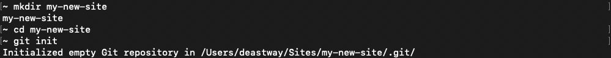
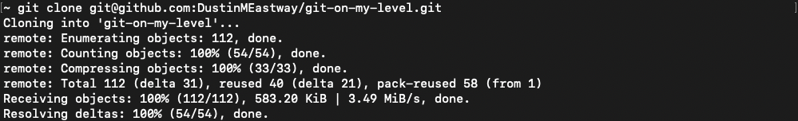
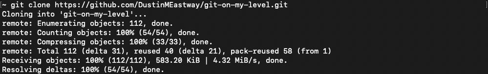
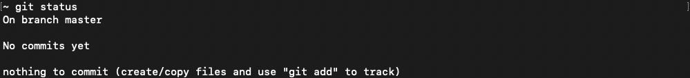
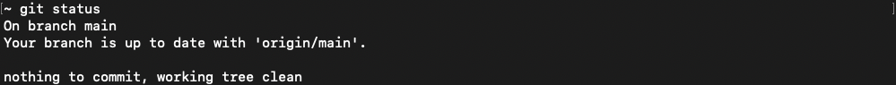

# Problems & Solutions

> [!IMPORTANT]
> Commands use `<>` to wrap sections of code that you should replace and `[]` to denote optional segments.
>
> Shorthand aliases (one "-" instead of "--") require a space instead of an equal sign when they accept values.
> Some commands (such as [git log](#git-log)) accept an even shorter alias where you can pass the value directly after a single "-" without a space.
>
> For example, all of the below commands log up to 3 of the last commits.
> ```bash
> git log --max-count=3
> git log -n 3
> git log -3
> ```
>
> Some commands, such as [git diff](#git-diff) need some parameters in a specific order (`[<commit>]` must come before `[<path to file(s)>]` if both are specified).
> In such cases, I list them in their required order below the command.
>
> For commands that accept file(s), you can specify them with spaces between them `file1.txt temp/file2.txt`, with wildcards `**/*.txt`, or add full directories `temp/`.
>
> For commands that accept commit hash(es) (or [HEAD](./terminology.md#head)) you can use `<commit hash>~<number>` to go back a `<number>` of commits from `<commit hash>` or the shorthand `<commit hash>~` to go back one.

> [!NOTE]
> Most of the below problems/solutions assume you have a local repository already with the exception of "[Get A Repository](#get-a-repository)" which helps you create a local repository.
>
> Solutions are roughly in the order I would expect you to run into the problems, but this is difficult to fully predict.

## Get A Repository

A Git [repository](./terminology.md#repository) (often called a repo), looks like a normal directory with a `.git` subdirectory in it. How you go about initializing your repository depends on whether you want to base it off from an existing repository or a local directory.

### Create A New Repository

Creating a Git repostiroy from a local directory (even if it is empty) can be done using the [git init command](./commands.md#git-init).

```bash
git init
```



### Clone An Existing Repository

Cloning a Git repository from a remote server can be done using the [git clone command](./commands.md#git-clone).

This will create a new directory with the same name as the repository and place the contents in the directory.

```bash
git clone git@github.com:DustinMEastway/git-on-my-level.git
```



> [!TIP]
> Alternatively, you can clone using HTTPS if you prefer not to set up SSH keys.
>
> ```bash
> git clone https://github.com/DustinMEastway/git-on-my-level.git
> ```
>
> 

## Get Status Of A Repository

Use the [git status command](./commands.md#git-status) to see the state of your local repository.

This will tell you the current branch, how many commits ahead and/or behind it you are, and your uncommitted changes.

```bash
git status
```

> [!NOTE]
> This will look something like below if you just [create a new repository](#create-a-new-repository).
>
> 

> [!NOTE]
> This will look something like below if you just [cloned an existing repository](#clone-an-existing-repository).
>
> 

### List Branches

#### List Local Branches

Use the [git branch command](./commands.md#git-branch) to display a list of branches on the local branches and display the branch you are currently on.

```bash
git branch
```

#### List Remote Branches

Use the [git branch command](./commands.md#git-branch) with the `--remote` (or `-r`) flag to display remote branches that existed last time you fetched information from the remote repositories.

> [!TIP]
> Use the [git fetch command](./commands.md#git-fetch) before the below command to get updated information.
> ```bash
> git fetch
> ```

```bash
git branch --remote
```

### List Commits

Use [git log](./commands.md#git-log) to display [commits](./terminology.md#commit) that exist on the current branch/[HEAD](./terminology.md#head).

I primarily use this command to display commit hashes for other commands or messages, authors, & dates to make sure my history looks like I expect it to.

```bash
git log
```
- `[--graph]` Displays an ASCII graph of branch & merge history.
    - `[--pretty=oneline]` pairs nicely with this command.
- `[--max-count=<number>]` Limit the max number of commits displayed.
    - **Alias(es)** `-n <number>`, `-<number>`.
- `[--patch]` Used to display a diff with commit information, but I generally use [git diff](#git-diff) instead.
- `[--pretty=<format>]` Used to change the amount & format of information displayed for each commit.
    - **Note**: See [git log pretty formats](https://git-scm.com/docs/git-log#_pretty_formats) for official documentation on supported formats.
    - Use `oneline` Displays the hash, branches pointing at the commit, & first line of message for each commit.
    - Use `format:"%H %s"` Display the hash & first line of message for each commit.

### Display Changes

#### Display Unstaged Changes

Use [git diff](./commands.md#git-diff) to display changed lines in [modified](./terminology.md#modified) files.

Optionally, pass file(s) as a final parameter to limit output to changes made in those files.

> [!TIP]
> For Git commands that accept file(s), you can specify them with spaces between them `file1.txt temp/file2.txt`, with wildcards `**/*.txt`, or add full directories `temp/`.

```bash
git diff [<path to file(s)>]
```
- `[<path to file(s)>]` you wish diff (default: diff all files).

#### Display Staged Changes

Use [git diff](./commands.md#git-diff) with the `--staged` flag to display changed lines in [staged](./terminology.md#staged) files.

> [!TIP]
> For Git commands that accept file(s), you can specify them with spaces between them `file1.txt temp/file2.txt`, with wildcards `**/*.txt`, or add full directories `temp/`.

```bash
git diff --staged [<path to file(s)>]
```
- `[<path to file(s)>]` you wish diff (default: diff all files).
- `[--staged]` display [staged](./terminology.md#staged) changes instead of [modified](./terminology.md#modified) changes.
    - **Alias(es)** `--cached`.

#### Display Committed Changes

Use [git diff](./commands.md#git-diff) with the `[<commit>]` parameter to display [committed changes](./terminology.md#committed-change).

> [!TIP]
> For Git commands that accept file(s), you can specify them with spaces between them `file1.txt temp/file2.txt`, with wildcards `**/*.txt`, or add full directories `temp/`.

> [!TIP]
> For Git commands that accept commit hash(es) (or [HEAD](./terminology.md#head)) you can use `<commit hash>~<number>` to go back a `<number>` of commits from `<commit hash>` or the shorthand `<commit hash>~` to go back one.

```bash
git diff <commit> [<path to file(s)>]
```
- `[<commit>]` You can pass various configurations of commit hashes (IDs) to display changes relative to those commits.
    - Use `<commit hash>` to display all changes since (but not including) the provided commit including your uncommitted work.
    - Use `<commit hash>~` to display all changes in and since the provided commit including your uncommitted work.
    - Use `<commit hash>~ <commit hash>` to display all changes in the provided commit.
    - Use `<start commit hash>~ <end commit hash>` to display all changes in the commit with `<start commit hash>`, the commit with `<end commit hash>` and all commits between them.
- `[<path to file(s)>]` you wish diff (default: diff all files).

## Adding Files

> [!TIP]
> For Git commands that accept file(s), you can specify them with spaces between them `file1.txt temp/file2.txt`, with wildcards `**/*.txt`, or add full directories `temp/`.

Use [git add](./commands.md#git-add) to move the [untracked](./terminology.md#untracked) changes of adding the file(s) to [staged](./terminology.md#staged) for the next time you [save your changes](./problems-and-solutions.md#save-changes).

```bash
git add <path to file(s)>
```
- `<path to file(s)>` you wish to [stage](./terminology.md#staged).

> [!TIP]
> To undo this action see "[undo staged changes](problems-and-solutions.md#undo-staged-changes)".

## Deleting Files

> [!NOTE]
> If you wish to remove file(s) from Git, but keep them locally, see the [ignoring file(s) solution](#ignoring-files).

> [!TIP]
> For Git commands that accept file(s), you can specify them with spaces between them `file1.txt temp/file2.txt`, with wildcards `**/*.txt`, or add full directories `temp/`.

While you can use [git rm](./commands.md#git-remove) to delete & [stage](./terminology.md#staged) file(s) at the same time, I recommend against it.

```bash
git rm <path to file(s)>
```
- `<path to file(s)>` you wish to delete & [stage](./terminology.md#staged).

Instead delete files using whatever tool you use to edit code, then using [git add](./commands.md#git-add) to [stage](./terminology.md#staged) them.

> [!NOTE]
> It may seem odd to use a command called "add" to delete a file, but this is another point in favor of thinking about [states of changes](./terminology.md#four-states-of-changes) instead of [states of files](./terminology.md#four-states-of-files) because the "add" is adding the change(s) which are removing the file(s).

The upside of this approach is that it more closely aligns with most people's workflow and the steps are consistent regardless of the [state of file(s)](./terminology.md#four-states-of-files) unlike [git rm](./commands.md#git-remove) which behaves differently depending on state of the file(s) being removed.

A potential downside of this approach is that you will not get a warning if you have [staged](./terminology.md#staged-change) changes on file(s) that you may want to [commit/save](#save-changes), then delete in a followup commit in case you want to go back to that state later.
This has not been an issue for me as I pay extra attention before deleting files in general and my editor moves deleted files into a trash that I can recover them from.

```bash
git add <path to file(s)>
```
- `<path to file(s)>` you wish to [stage](./terminology.md#staged).

## Ignoring Files

> [!NOTE]
> If you wish to remove file(s) from Git and remove them locally, see the [deleting file(s) solution](#deleting-files).

Sometimes you want to have files in your repository without having them checked in to share with others.

For example, environment files may contain private values that you do not want checked in.

### Ignoring Untracked Files

Create a [.gitignore file](https://git-scm.com/docs/gitignore) and add patterns that match files you wish for Git to ignore instead of displaying as [untracked](./terminology.md#untracked).

> [!IMPORTANT]
> `.gitignore` only works on [untracked](./terminology.md#untracked) files. If you already [staged](./terminology.md#staged-change) and/or [committed](./terminology.md#committed-change) changes in a file you wish to ignore, then follow the [ignoring committed/staged files solution](./problems-and-solutions.md#ignoring-committedstaged-files).

```bash
# Lines starting with "#" are comments.

# Use the name of a file/directory to ignore it.
# Ignore all files, nested files, & subdirectories called ".DS_Store".
.DS_Store

# Use "\" to escape special characters ("#", "*", "?") in file names.
# Ignore all files, nested files, & subdirectories called "my#special?file*".
my\#special\?file\*

# Use "/" to the end of a pattern ignores directories, but not files.
# Ignore all subdirectories named "node_modules".
node_modules/

# Use "/" to the beginning or middle of a pattern makes the path relative to the current ".gitignore" file.
# Ignore the "generated" subdirectory at the same level as the ".gitignore" file.
/generated/
```

### Ignoring Committed/Staged Files

`.gitignore` only works on [untracked](./terminology.md#untracked) files. If you already [staged](./terminology.md#staged) or [committed](./terminology.md#commit) a file then do the following.

1. Rename the file(s) to temporary name(s).

2. Use [git add](./commands.md#git-add) to move the [untracked](./terminology.md#untracked) changes of removing the file(s) (not adding the temporary file(s)) to [staged](./terminology.md#staged).

```bash
git add <path to file(s)>
```

3. Rename the file(s) back to the original name(s).

4. Now that you have staged their deletions, the files will show up as [untracked](./terminology.md#untracked) which means you can use the [ignoring untracked files solution](./problems-and-solutions.md#ignoring-untracked-files).

## Moving/Renaming A File

> [!IMPORTANT]
> Git does not directly track file movement (renaming is just moving) as you do it. Instead it looks at the content of added/deleted files in a commit to decide which ones match close enough for it to consider them a move/rename instead of a separate add change & delete change.
>
> This means that if you make many changes to a file's contents at the same time as you move it, it will be counted as adding a new file and will lose its history. Instead, move the file without changing its contents, [save your changes](#save-changes), modify its contents, then [save your changes](#save-changes) again.

While you can use [git mv](./commands.md#git-move) to move & [stage](./terminology.md#staged) a file at the same time, I recommend against it.

```bash
git mv <path to file> <new path to file>
```
- `<path to file>` you wish to move/rename.
- `<new path to file>` you wish to create & [stage](./terminology.md#staged).

Instead move files using whatever tool you use to edit code, then using [git add](./commands.md#git-add) to [stage](./terminology.md#staged) deleting their old location and add their new location which does the same thing.

The upside of this approach is that it more closely aligns with most people's workflow and the steps are consistent regardless of the [state of file(s)](./terminology.md#four-states-of-files) unlike [git mv](./commands.md#git-move) which behaves differently depending on state of the file being moved.

A downside of this approach is that [git mv](./commands.md#git-move) keeps [committed changes](./committed-change), [staged changes](./staged-change) & [unstaged changes](./unstaged-change) exactly as they were at the old path when you move a file.
I usually move files separately from modifying their content (recommended to keep Git from thinking it is an add & delete instead of a move), so this downside does not come into play for my workflow.

```bash
git add <path to file(s)>
```
- `<path to file(s)>` you wish to [stage](./terminology.md#staged).

## Save Changes

To save a change, you must first use [git add](./commands.md#git-add) to move the [untracked](./terminology.md#untracked-change) or [unstaged](./terminology.md#unstaged-change) change to the [staged](./terminology.md#staged-change) state.

> [!TIP]
> For Git commands that accept file(s), you can specify them with spaces between them `file1.txt temp/file2.txt`, with wildcards `**/*.txt`, or add full directories `temp/`.

```bash
git add <path to file(s)>
```
- `<path to file(s)>` you wish to [stage](./terminology.md#staged).

Then use [git commit](./commands.md#git-commit) move the changes to a [committed](./terminology.md#committed-change) state.

```bash
git commit -m "<message>"
```
- `[--message="<message>"]` adds a line to the commit message instead of bringing the editor up.
    - **Alias(es)**: `-m "<message>"`.
    - **Note**: Technically the quotes are not required, but I recommend always adding them to keep messages with spaces together.

## Undo Changes

### Undo Untracked Changes

Since Git is not tracking [untracked changes](./terminology.md#untracked-change) you can just delete them using your code editor.

> [!CAUTION]
> Deleting files before they are committed means those files are gone for good unless you can find them in your trash can.
> If you may want the changes back later, first [save them](./problems-and-solutions.md#save-changes), then undo the changes in a second commit.

### Undo Unstaged Changes

Use the [git restore](./commands.md#git-restore) command to undo all [unstaged changes](./terminology.md#unstaged-change) in file(s) setting them back to their [staged changes](./terminology.md#staged-change) if they have them or [committed changes](./terminology.md#committed-change) if they do not.

> [!CAUTION]
> When used without the `--staged` flag, [git restore](./commands.md#git-restore) undoes changes before they are committed which makes them impossible to recover.
> If you may want the changes back later, first [save them](./problems-and-solutions.md#save-changes), then undo the changes in a second commit.

> [!TIP]
> For Git commands that accept file(s), you can specify them with spaces between them `file1.txt temp/file2.txt`, with wildcards `**/*.txt`, or add full directories `temp/`.

```bash
git restore <path to file(s)>
```
- `<path to file(s)>` you wish to restore.

### Undo Staged Changes

Use the [git restore](./commands.md#git-restore) command with the `--staged` flag to move [staged changes](./terminology.md#staged-change) to [unstaged](./terminology.md#unstaged-change) or [untracked](./terminology.md#untracked-change) depending on what state they were in before being staged.

> [!CAUTION]
> When used with the `--staged` flag, [git restore](./commands.md#git-restore) will mix [staged changes](./terminology.md#staged-change) in with [unstaged changes](./terminology.md#unstaged-change) if there are any which will be difficult or impossible to split back up.
> If you may want the state the [staged changes](./terminology.md#staged-change) are in back later, first [save them](./problems-and-solutions.md#save-changes), then continue work on your [unstaged changes](./terminology.md#unstaged-change).

> [!TIP]
> For Git commands that accept file(s), you can specify them with spaces between them `file1.txt temp/file2.txt`, with wildcards `**/*.txt`, or add full directories `temp/`.

```bash
git restore --staged <path to file(s)>
```
- `[--staged]` moves [staged changes](./terminology.md#staged-change) to [unstaged](./terminology.md#unstaged-change) or [untracked](./terminology.md#untracked-change) depending on what state they were in before being added.
- `<path to file(s)>` you wish to restore.

### Undo Committed Changes

Instead of removing prior commits, I recommend you use [git revert](./commands.md#git-revert) to undo [committed changes](./terminology.md#committed-change) by adding new [committed changes](./terminology.md#committed-change) that do the opposite of the original commit.

> [!TIP]
> Use the `[--no-commit]` flag to [staged](./terminology.md#staged-change) reverted changes.

```bash
git revert <commit hash>
```
- `[--no-commit]` Places reverted changes in a [staged](./terminology.md#staged-change) state instead of [committed](./terminology.md#committed-change).
- `<commit hash>` Hash of the commit to undo.

If you insist that the original commit must be removed instead of undoing the changes in a new commit, then use [git reset](./commands.md#git-reset) to remove commits.

> [!CAUTION]
> When using reset to remove commits you are almost definitely modifying the history of a branch ([see the perils of rebasing](https://git-scm.com/book/en/v2/Git-Branching-Rebasing#_rebase_peril)), so I recommend using [git revert](./commands.md#git-revert) instead of reset when possible.
>
> If you use this command while you have changes that are not [committed](./terminology.md#committed-change), then you are likely to mix committed changes in with them or delete them altogether which will likely be impossible to undo.

```bash
git reset [<mode>] [<commit to remove>]
```
- `[<mode>]` Determines which changes to reset and where to reset them to.
    - `[--hard]` Undoes [committed changes](./terminology.md#committed-change) since the commit before `[<commit to remove>]`, [staged changes](./terminology.md#staged-change), and [unstaged changes](./terminology.md#unstaged-change).
        - **Warning**: Everything except for [untracked changes](./terminology.md#untracked-change) will be undone which is difficult to put back. The prior [committed changes](./terminology.md#committed-change) can [be found again with some effort](./problems-and-solutions.md#find-commit-without-a-branch).
    - `[--mixed]` Moves [committed changes](./terminology.md#committed-change) since the commit before `[<commit to remove>]` and [staged changes](./terminology.md#staged-change) to  [unstaged](./terminology.md#unstaged-change).
        - **Warning**: The reset changes & staged changes mix with existing unstaged changes.
    - `[--soft]` Moves [committed changes](./terminology.md#committed-change) since the commit before `[<commit to remove>]` to [staged](./terminology.md#staged-change).
        - **Warning**: The reset changes mix with existing staged changes.
- `[<commit to remove>]` Commit to reset the changes in along with all of the changes after it.

## Non-Linear Development

## Collaborate

### Use Code From Others

## Audit Code

### Figure Out Who Modified Code Last

## Migration

### Moving Repositoy To A New Server

> [!NOTE]
> The below graphic was stolen from [Chapter 1.1 (figure 3) of the Pro Git book V2](https://git-scm.com/book/en/v2/Getting-Started-About-Version-Control#_distributed_version_control_systems).


