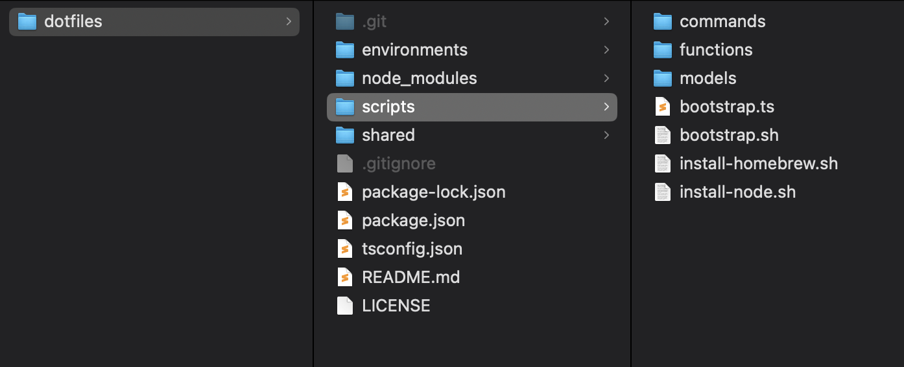
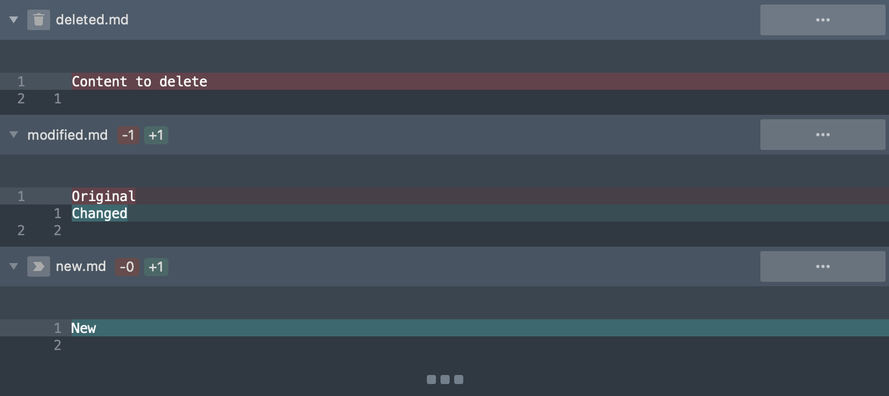
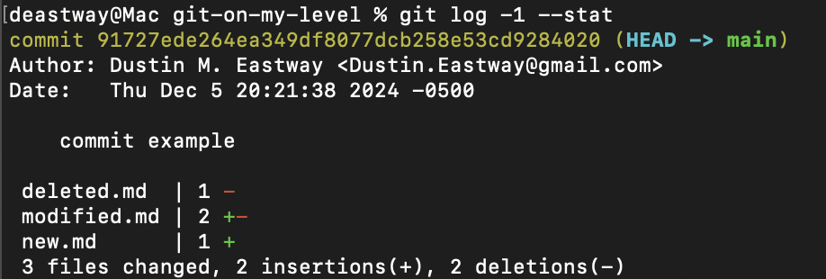
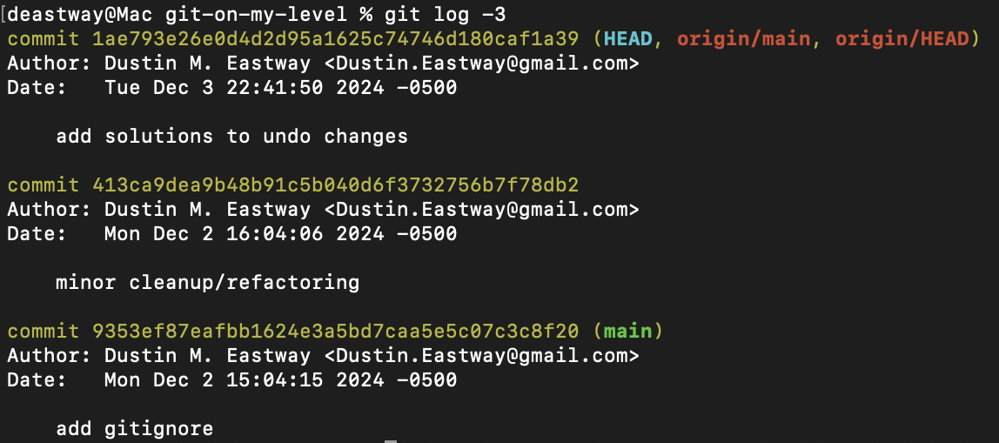
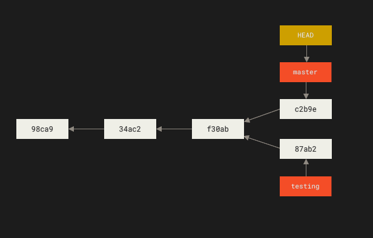
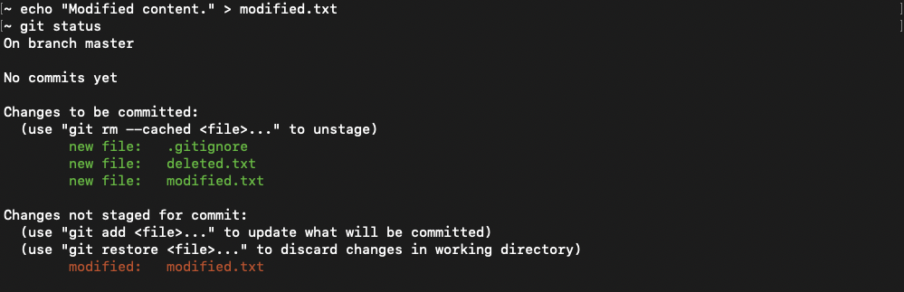
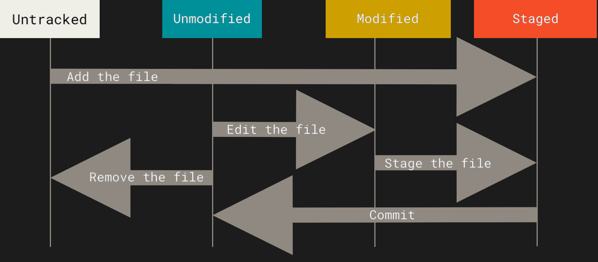

# Terminology

## General

### Directory

This concept is basically the same as the one you think of when you think of a "folder" to store files in.

> [!NOTE]
> To see why I prefer this term over "folder", read the [folder metaphor on Wikipedia](https://en.wikipedia.org/wiki/Directory_%28computing%29#Folder_metaphor).

### Repository

This is just a [directory](#directory) where all of your code files live that you can share with your team.

Git creates a special `.git` subdirectory within the repository to store all of its information like [branches](#branch) & [commits](#commit).

### Change

An addition, deletion, or modification to file(s) in the repository.

> [!NOTE]
> You cannot save an empty [directory](#directory). You add files which will bring their directories if they are nested in them.

### Commit

A saved state of files in the repository including auxiliary information like author & date of the save.

### Head

The currently checked out (loaded) commit (save/version) of a repository.

This can be accessed by commands that accept a commit hash using `HEAD` in place of the latest commit hash.

### Branch

A human readable name attached to a specific [commit](#commit).

> [!NOTE]
> The below graphic was stolen from [Chapter 3.1 (figure 17) of the Pro Git book V2](https://git-scm.com/book/en/v2/Git-Branching-Branches-in-a-Nutshell#_switching_branches).

### Author

The person that wrote the code in a [commit](#commit).

### Committer

The person that committed the [commit](#commit). This is usually the same as [author](#author), but can be different when someone uses [git rebase](./commands.md#git-rebase) or someone merges code on someone else's behalf.

### Local

Refers to directories, files, & repositories stored on the computer you develop on opposed to [remote](#remote).

### Remote

Refers to a server that can serve as the common source of truth for the Git repository that you (and your team, if applicable) are working on [locally](#local).

### Client

The tool used to run Git commands. This can be a command line or graphical user interface.

Below are some of the many options to use as clients in order of how much I like them.
1. [Sublime Merge](https://www.sublimemerge.com/) (freemium).
2. [Git CLI](https://git-scm.com/downloads) (free).
3. [Built-in VS Code collaboration tools](https://code.visualstudio.com/) (free).
4. [Github Desktop](https://github.com/apps/desktop) (free).

## Version Control

A system to track different versions of files. Specifically, Git makes the below tasks relatively easy.

- [Undo a specific change or all changes back to a prior version](./problems-and-solutions.md#undo-changes).
- [Handle non-linear development](./problems-and-solutions.md#non-linear-development).
- [Collaborate with your team without copy/pasting files](./problems-and-solutions.md#collaborate).
- [Audit who modified code and when they did it](./problems-and-solutions.md#audit-code).
- [Keep history on each machine in case the server hosting the code dies](./problems-and-solutions.md#migration).

## Four States Of Files

> [!IMPORTANT]
> A "Staged" file can be "Modified" at the same time if it has [unstaged changes](#unstaged-change).
> This happens when a "Staged" file is modfied after being staged or if you stage specific sections with a tool like Sublime Merge or VS Code.
>
> 

> [!NOTE]
> The below graphic was stolen from [Chapter 2.2 (figure 8) of the Pro Git book V2](https://git-scm.com/book/en/v2/Git-Basics-Recording-Changes-to-the-Repository#_recording_changes_to_the_repository).

### Untracked

Git has not been told to track the file.

> [!IMPORTANT]
> Untracked files do not display in `git status` if they match a path in `.gitignore`.

#### Ignored

[Git .gitignore Documentation](https://git-scm.com/docs/gitignore).

Ignored files are [untracked](#untracked) and match a patern in the `.gitignore` which tells Git to hide them from the [status command](commands.md#git-status) instead of showing them as [untracked](#untracked).

In addition (pun intended), [add command](commands.md#git-add) will not add ignored files unless you specifically add them and use a flag to force the matter.

See [ignoring untracked files](./problems-and-solutions.md#ignore-untracked-files) for more information on using `.gitignore`.

> [!TIP]
> `.gitignore` only works on [untracked](#untracked) files. If you already [staged](./terminology.md#staged-change) and/or [committed](./terminology.md#committed-change) changes in a file you wish to ignore, then follow the [ignore committed/staged files solution](./problems-and-solutions.md#ignore-committedstaged-files).

### Unmodified

No changes have been made since the last commit/stage.

> [!IMPORTANT]
> Unmodified files do not display in `git status`.

### Modified

File has changes that will not go into the next commit.

### Staged

File state set to go into the next commit.

## Four States Of Changes

We usually think about adding/deleting/saving a full file, so it makes sense for that mindset to bleed over into how we think about Git.

That said, I recommend trying to think of Git files in terms of changes instead. This minor change in thinking makes the below concepts easier to understand.
- A change can only be in one status unlike files which can be in multiple states at the same time.
  - This even makes files being [modified](#modified) & [staged](#staged) at the same time easier to understand. It is because the file has two changes, one [staged](#staged-change) and one [unstaged](#unstaged-change).
- [Unmodified](#unmodified) files actually represent two states. All changes in the file could be [staged](#staged-change) or [committed](#committed-change).
- We can use the term "[unstaged](#unstaged-change)" for a change instead of "[modified](#modified)" like we do with files.
  - This is better because most people's intuition would tell them that a [staged](#staged) file is "modified", but it is [unmodified](#unmodified) with the way we are using it.
  - We should not use "unstaged" in place of "modified" for files because they can be [modified](#modified) & [staged](#staged) simultaneously which would make them "unstaged" & "staged" simultaneously.

> [!NOTE]
> Adding & deleting a file should also be viewed as changes. The only difference is that adding starts as an [untracked change](#untracked-change) while deleting starts as an [unstaged change](#unstaged-change).

### Untracked Change

The change is adding a file that Git has not been told to track yet.

#### Ignored Change

The change exists within an [ignored file](#four-states-of-files#ignored).

### Unstaged Change

Change made to an [unmodified](#four-states-of-files#unmodified) or [staged](#four-states-of-files#staged) file that has not been [staged](#staged-change) yet.

### Staged Change

Change set to go into the next commit.

### Committed Change

Change already added to a [commit](#commit) to "save" it.
